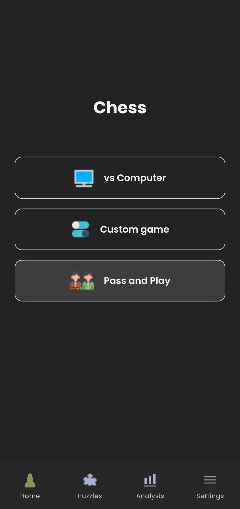
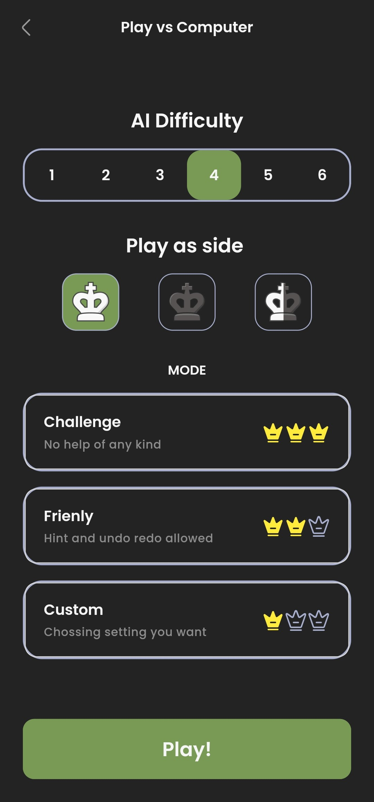
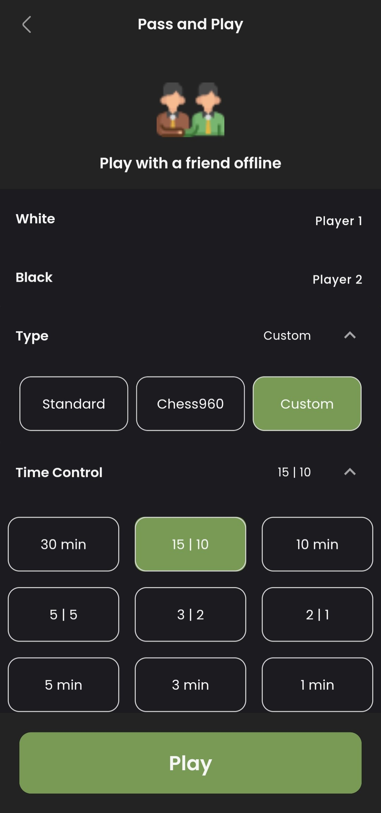
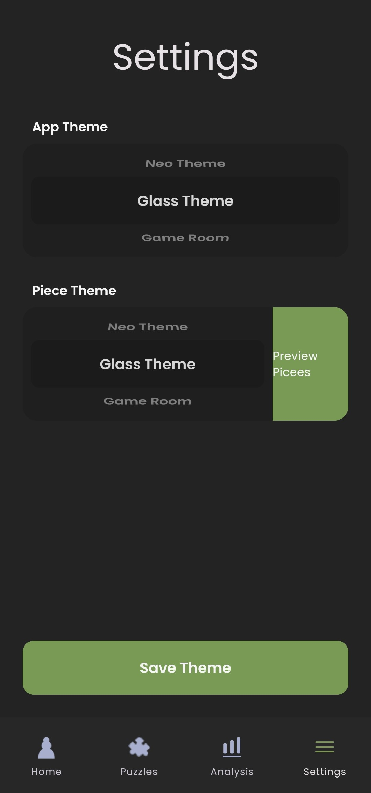
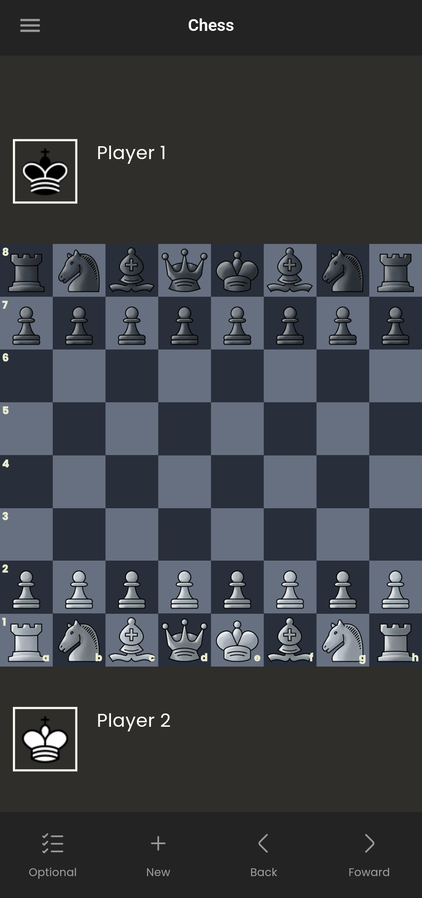
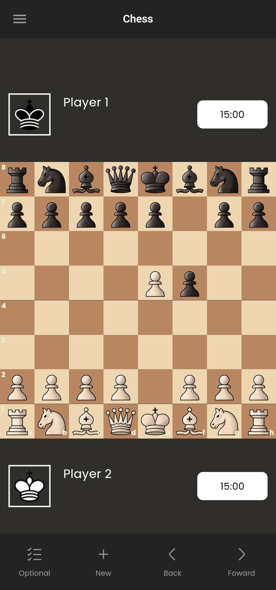
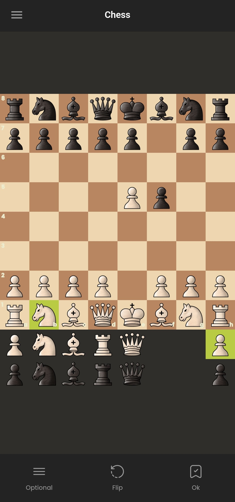

# Royal Strategist
Royal Strategistis a chess app written in Flutter and using getX for State Management. The project is referenced and learned from [EnPassant](https://github.com/SebLague/Chess-Coding-Adventure/tree/Chess-V2-UCI) and [Chess-Coding-Adventure](https://github.com/SebLague/Chess-Coding-Adventure/tree/Chess-V2-UCI) and and be inspired and follow in the interface design with [chess.com](https://www.chess.com/home) . It's a project submitted for the cross-platform mobile application development course in VKU University in second semester of the third year (1/2024 - 5/2025).

## Features
The game have two mode 1 player ( vs Computer ) or 2 player gameplay (Pass and Play) (2 player is offline)

### 1 player mode ( vs Computer )
- Contain Six AI difficulty levels

### 2 player mode (Pass and Play)
- Custom starting board and input from FEN
- Enable timer and 
- Undo and Redo chess Board

### Other features
- Customizable app theme
- Customizable piece theme

## AI Description

The algorithm used in this app is based on both minimax and alpha-beta algorithms. It looks at the possible moves according to the search depth as defined by minimax. There are six difficulty levels in the chess AI app. The highest difficulty level is level 6, which is like looking at three full chess moves in advance. For more information on how alpha-beta works, please refer to [link](https://www.chessprogramming.org/Alpha-Beta).

## ScreenShot

